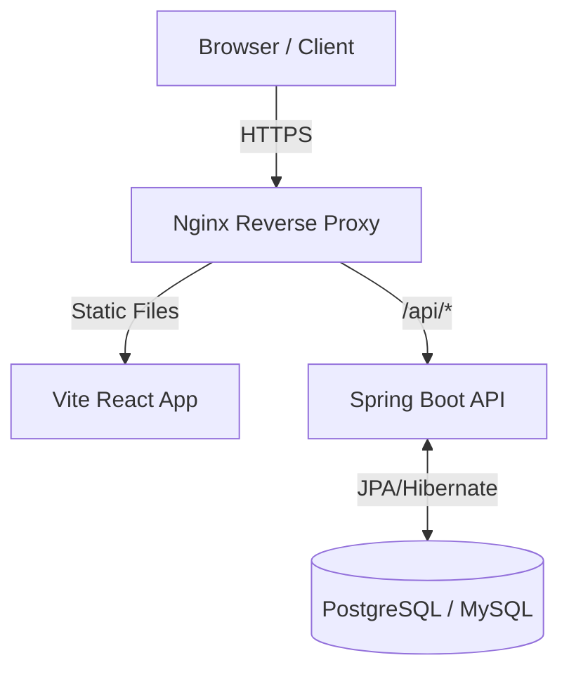
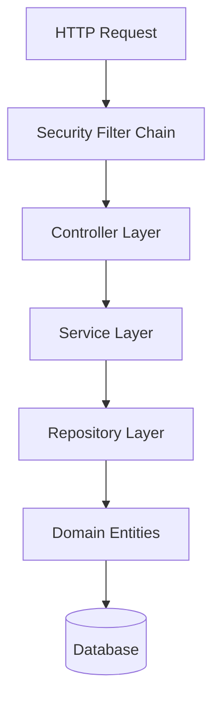
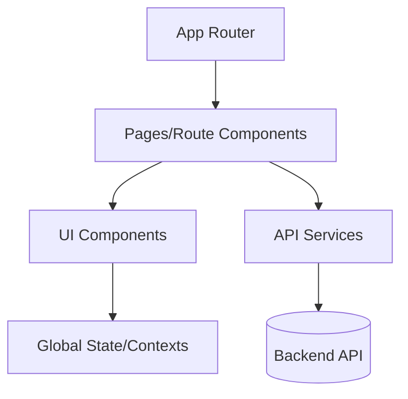

# 🏗️ Vocalis - Architecture

Tài liệu này mô tả kiến trúc tổng thể của hệ thống Vocalis.

---

## 1. Tổng quan kiến trúc (High-Level Architecture)

Hệ thống được thiết kế theo kiến trúc **Client-Server** (Frontend và Backend tách biệt), giao tiếp qua **RESTful API**.

### 1.1. Các thành phần chính

1. **Client (Browser):** Chạy ứng dụng React (SPA).
2. **Nginx Reverse Proxy:** Xử lý routing tĩnh cho SPA, điều hướng requests bắt đầu bằng `/api/` tới Backend.
3. **Frontend Application:** Ứng dụng React build bằng Vite.
4. **Backend API:** Spring Boot application xử lý business logic.
5. **Database:** CSDL Quan hệ lưu trữ dữ liệu (Users, Decks, Flashcards...).

---

## 2. Backend Architecture (Spring Boot)

Backend được tổ chức theo kiến trúc **Layered (N-Tier) Architecture** phổ biến của Spring Boot.

### 2.1. Các Layers chính

1. **Controller Layer (`com.sonnguyen.base.controller`)**
   - Xử lý HTTP requests và responses.
   - Nhận request body, map vào DTO (Data Transfer Object).
   - Input validation (sử dụng `@Valid`).
   - Gọi Service tương ứng, KHÔNG chứa business logic.
   - Luôn trả về `ResponseEntity<BaseResponse<T>>`.

2. **Service Layer (`com.sonnguyen.base.service`)**
   - Chứa **toàn bộ business logic**.
   - Interface (`DeckService`) định nghĩa hợp đồng.
   - Implementation (`DeckServiceImpl`) chạy thực tế.
   - Quản lý Transactions (`@Transactional`).
   - Mọi nghiệp vụ, quyền truy cập... phải nằm tại đây.

3. **Repository Layer (`com.sonnguyen.base.repository`)**
   - Spring Data JPA interfaces.
   - Các Custom Queries (JPQL/Native).
   - Tương tác trực tiếp với Database.

4. **Security Layer (`com.sonnguyen.base.security`)**
   - JWT authentication.
   - Method-level authorization với `@PreAuthorize`.

---

## 3. Frontend Architecture (ReactJS + Vite)

Frontend sử dụng Next.js/React theo mô hình **Component-based**.

### 3.1. Phân chia logic

- **Pages (`src/pages`)**: Chứa các component đại diện cho từng tuyến đường (VD: `Study.jsx`, `DeckDetail.jsx`). Gọi API thông qua Services và cung cấp prop cho Components.
- **Components (`src/components`)**: Các khối UI độc lập (Button, Card, Modal, vv...).
- **Services (`src/services`)**: Mọi lời gọi HTTP/axios nằm tại đây (`axios.get('/api/decks')`). **Không** gọi axios trực tiếp trong component.
- **Contexts (`src/contexts`)**: Quản lý State chung (Ví dụ: `AuthContext` lưu trữ thông tin User sau login, `ThemeContext` đổi Dark/Light mode).

---

## 4. Luồng xử lý dữ liệu (Data Flow)

Ví dụ luồng lấy thông tin một Bộ từ vựng (Deck) để học:

1. **Client Action:** User bấm nút "Học ngay" ở UI (`StudyMode.jsx`).
2. **Frontend Service:** React component gọi hàm `getDeckFiles(deckId)` ở tầng `services/deck.service.js`. Hàm này dùng axios bắn request `GET /api/v1/decks/{id}/flashcards`.
3. **Backend Security:** Request đi qua Nginx vào Spring Boot. Spring Security Filter kiểm tra JWT trong header. Nếu hợp lệ (User có quyền xem Deck này), cho phép đi tiếp.
4. **Backend Controller:** `DeckController` nhận `id`, gọi `deckService.getFlashcards(id)`.
5. **Backend Service:** `DeckService` gọi repository và thực hiện business logic (KIểm tra đây là deck Public hay Private của user này).
6. **Backend Repository:** Truy vấn CSDL `SELECT * FROM flashcards WHERE deck_id = ...`.
7. **Response:** Dữ liệu ánh xạ ra dạng DTO (che giấu metadata nhạy cảm), controller bọc trong `BaseResponse` và trả lại JSON `200 OK`.
8. **Client Render:** Axios nhận json, `StudyMode` update state (bằng `useState`/`useEffect`) và render danh sách Flashcards ra màn hình học.

---

## 5. Mở rộng (Scalability considerations)

Kiến trúc hiện tại (Monolith Backend) hoàn toàn phù hợp với quy mô MVP. Trong tương lai nếu hệ thống lớn lên:
- Có thể dùng Docker để scale-up nhiều instance cho Spring Boot backend qua load balancer Nginx.
- Nếu lượng từ vựng quá lớn gây áp lực cho DB (hàng triệu bản ghi), có thể thêm tầng Redis Cache trước khi Select từ DB.
- Tách riêng service Image upload nếu hỗ trợ úp ảnh cho Flashcard lên các dịch vụ như S3 AWS / Cloudinary thay vì lưu trực tiếp vào ổ cứng server.
