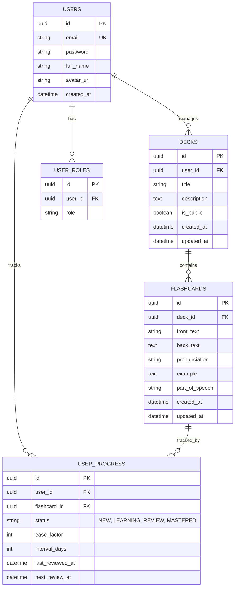

# 🗄️ Vocalis - Database Schema

Dự kiến sơ đồ cơ sở dữ liệu quan hệ cho nền tảng học tiếng Anh bằng Flashcard. 

---

## 1. Sơ đồ thực thể (ERD Diagram)

---

## 2. Chi tiết các bảng (Tables Detail)

### 2.1. Bảng `users`
Lưu trữ thông tin người dùng.
- `id` (UUID, PK)
- `email` (Varchar 255, Unique, Not Null)
- `password` (Varchar 255, Not Null, BCrypt Encoded)
- `full_name` (Varchar 255, có thể nullable trước khi update profile)
- `avatar_url` (Varchar 500)
- `created_at` (Timestamp, Default CURRENT_TIMESTAMP)

### 2.2. Bảng `user_roles`
Phân quyền cơ bản cho người dùng.
- `id` (UUID, PK)
- `user_id` (UUID, FK -> users.id, Not Null)
- `role` (Enum: `USER`, `ADMIN`)

### 2.3. Bảng `decks`
Quản lý các bộ từ vựng (thư mục flashcards).
- `id` (UUID, PK)
- `user_id` (UUID, FK -> users.id, Của người sở hữu tạo ra)
- `title` (Varchar 255, Not Null)
- `description` (Text)
- `is_public` (Boolean, Default FALSE - Có chia sẻ cho mọi người xem không)
- `created_at`, `updated_at` (Timestamp)

### 2.4. Bảng `flashcards`
Lưu trữ thẻ từ vựng thuộc về 1 bộ (Deck).
- `id` (UUID, PK)
- `deck_id` (UUID, FK -> decks.id, Not Null)
- `front_text` (Varchar 255, Not Null - Từ tiếng Anh)
- `back_text` (Text, Not Null - Nghĩa tiếng Việt/English)
- `pronunciation` (Varchar 255 - Phiên âm IPA)
- `example` (Text - Câu ví dụ)
- `part_of_speech` (Varchar 50 - Noun, Verb, Adj...)
- `created_at`, `updated_at` (Timestamp)

### 2.5. Bảng `user_progress` (Quan trọng: Spaced Repetition)
Lưu lại lịch sử học tập và tính toán ngày cần ôn lại của mỗi từ cho mỗi user.
Một Flashcard dù thuộc Public Deck người khác tạo, người dùng (`user_id`) vẫn có tiến trình học riêng.
- `id` (UUID, PK)
- `user_id` (UUID, FK -> users.id)
- `flashcard_id` (UUID, FK -> flashcards.id)
- `status` (Enum: `NEW`, `LEARNING`, `REVIEW`, `MASTERED`)
- `ease_factor` (Tùy thuật toán SRS, vd thuật toán SM-2)
- `interval_days` (Số ngày khoảng cách giữa 2 lần ôn)
- `last_reviewed_at` (Timestamp lần cuối lật mặt thẻ)
- `next_review_at` (Timestamp ngày tiếp theo sẽ xuất hiện lại)

## 3. Indexes & Performance
Chỉ mục cần thiết trên các cột hay tìm kiếm.
- `IDX_decks_user_id` trên `decks(user_id)`
- `IDX_flashcards_deck_id` trên `flashcards(deck_id)`
- `IDX_user_progress_user_id` trên `user_progress(user_id)`
- `IDX_user_progress_next_review` trên `user_progress(next_review_at)`

## 4. Ràng buộc toàn vẹn (Constraints)
- Khi xóa `User` cascade xóa `Decks`, `User_progress` và `User_Roles`.
- Khi xóa `Deck` cascade xóa `Flashcards` và tiến trình học gắn với `Flashcard` đó.
