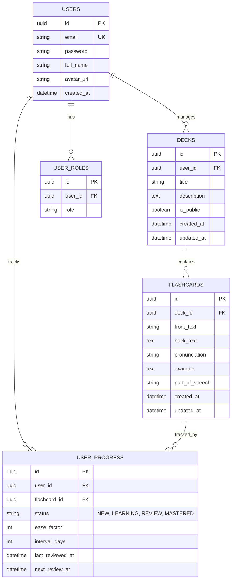

# 🗄️ Vocalis - Database Schema

Dự kiến sơ đồ cơ sở dữ liệu quan hệ cho nền tảng học tiếng Anh bằng Flashcard. 

---

## 1. Sơ đồ thực thể (ERD Diagram)



---

## 2. Chi tiết các bảng

### 2.1. Bảng `users` - Người dùng hệ thống
Lưu trữ thông tin tài khoản người dùng đăng nhập hệ thống.

```sql
CREATE TABLE users (
    id              UUID PRIMARY KEY DEFAULT gen_random_uuid(),
    email           VARCHAR(255) NOT NULL UNIQUE,
    password        VARCHAR(255) NOT NULL,
    full_name       VARCHAR(255),
    avatar_url      VARCHAR(500),
    created_at      TIMESTAMP WITH TIME ZONE DEFAULT CURRENT_TIMESTAMP
);

CREATE INDEX idx_users_email ON users(email);
```

### 2.2. Bảng `user_roles` - Quyền truy cập hệ thống
Phân quyền cơ bản cho người dùng.

```sql
CREATE TABLE user_roles (
    id              UUID PRIMARY KEY DEFAULT gen_random_uuid(),
    user_id         UUID NOT NULL,
    role            VARCHAR(50) NOT NULL,

    CONSTRAINT fk_user_roles_user FOREIGN KEY (user_id) REFERENCES users(id) ON DELETE CASCADE,
    CONSTRAINT chk_role CHECK (role IN ('USER', 'ADMIN'))
);

CREATE INDEX idx_user_roles_user_id ON user_roles(user_id);
```

### 2.3. Bảng `decks` - Quản lý bộ học (Deck)
Quản lý các thư mục đóng gói từ vựng.

```sql
CREATE TABLE decks (
    id              UUID PRIMARY KEY DEFAULT gen_random_uuid(),
    user_id         UUID NOT NULL,
    title           VARCHAR(255) NOT NULL,
    description     TEXT,
    is_public       BOOLEAN DEFAULT FALSE,
    created_at      TIMESTAMP WITH TIME ZONE DEFAULT CURRENT_TIMESTAMP,
    updated_at      TIMESTAMP WITH TIME ZONE DEFAULT CURRENT_TIMESTAMP,

    CONSTRAINT fk_decks_user FOREIGN KEY (user_id) REFERENCES users(id) ON DELETE CASCADE
);

CREATE INDEX idx_decks_user_id ON decks(user_id);
```

### 2.4. Bảng `flashcards` - Quản lý thẻ học
Lưu trữ thẻ từ vựng với các mặt trước/sau.

```sql
CREATE TABLE flashcards (
    id              UUID PRIMARY KEY DEFAULT gen_random_uuid(),
    deck_id         UUID NOT NULL,
    front_text      VARCHAR(255) NOT NULL,
    back_text       TEXT NOT NULL,
    pronunciation   VARCHAR(255),
    example         TEXT,
    part_of_speech  VARCHAR(50),
    created_at      TIMESTAMP WITH TIME ZONE DEFAULT CURRENT_TIMESTAMP,
    updated_at      TIMESTAMP WITH TIME ZONE DEFAULT CURRENT_TIMESTAMP,

    CONSTRAINT fk_flashcards_deck FOREIGN KEY (deck_id) REFERENCES decks(id) ON DELETE CASCADE
);

CREATE INDEX idx_flashcards_deck_id ON flashcards(deck_id);
```

### 2.5. Bảng `user_progress` - Tiến độ từng thẻ
Lưu lại lịch sử ôn tập thuật toán Spaced Repetition cho mỗi người dùng với một thẻ cụ thể.

```sql
CREATE TABLE user_progress (
    id               UUID PRIMARY KEY DEFAULT gen_random_uuid(),
    user_id          UUID NOT NULL,
    flashcard_id     UUID NOT NULL,
    status           VARCHAR(50) NOT NULL DEFAULT 'NEW',
    ease_factor      INT DEFAULT 250,
    interval_days    INT DEFAULT 0,
    last_reviewed_at TIMESTAMP WITH TIME ZONE,
    next_review_at   TIMESTAMP WITH TIME ZONE,

    CONSTRAINT fk_progress_user FOREIGN KEY (user_id) REFERENCES users(id) ON DELETE CASCADE,
    CONSTRAINT fk_progress_flashcard FOREIGN KEY (flashcard_id) REFERENCES flashcards(id) ON DELETE CASCADE,
    CONSTRAINT chk_status CHECK (status IN ('NEW', 'LEARNING', 'REVIEW', 'MASTERED'))
);

CREATE INDEX idx_user_progress_user_id ON user_progress(user_id);
CREATE INDEX idx_user_progress_next_review ON user_progress(next_review_at);
```
